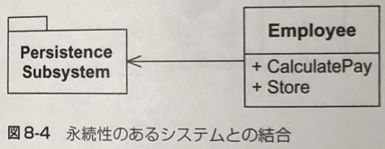
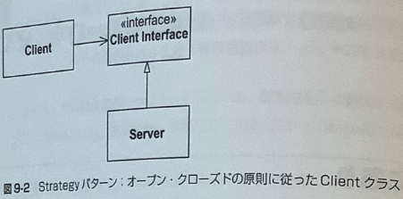

# **アジャイルソフトウェア開発の奥義**

## **第８章　単一責任の原則（SRP）**
SRP: The Single Responsibility Principle

**クラスを変更する理由は１つ以上存在してはならない。**  
  
　第6章のボウリングの例では、開発している間、Gameクラスはずっと2つの役割（責任） ―現在のフレームの状態記録とスコアの計算― を果たしていた。最後になって、この2つの役割を2つのクラスに分割することにした。Gameクラスはそのままフレームの状態を記録することにして、Scorerクラスがスコアの計算を担当することになったわけだ。  
　2つの役割を別々のクラスに分けるのが、なぜそんなに重要だったのだろう？役割が複数あれば、その1つ1つが変更理由になってしまうからだ。仕様要求が変わると、クラスの役割が変化するので、どのように変化したのかを見れば、変更部分が浮き彫りになる。しかし、クラスが複数の役割を背負ってしまうと、クラスを変更する理由も複数になってしまい、変更部分がぼやけてしまう。  
　クラスが複数の役割を背負っているような場合、それらの役割は結合してしまう。その結果、ある役割が変更を受けると、そのクラスが担っている他の役割も影響を受け、不具合が生じる可能性がある。こういったたぐいの結合は、ある部分が変更を受けると、予想もしない形で壊れてしまうような**もろい**設計を生み出してしまう。

### **8.1.1　役割とは何か？**
　単一責任の原則（SRP）では、「役割（責任）＝変更理由」と定義している。クラスを変更するのに2つ以上の理由がある場合、そのクラスには2つ以上の役割があることになる。しかし、クラスが2つ以上の役割を担っているかどうかを見極めるのは難しい。たとえば、リスト8-1に示すようなModemインタフェースを考えてみよう。ほとんどの人が、これが非常に合理的なインタフェースであることに同意するだろう。

```Java
リスト8-1: Modem.java ―― 単一責任の原則（SRP）違反

interface Modem
{
  public void dial(String pno);
  public void hangup();
  public void send(char c);
  public char recv();
}
```

　しかしながら、ここには2つの役割が記述されている。最初の役割は「接続の管理」であり、2つ目の役割は「データ通信」である。dial関数とhangup関数はモデムの接続を管理しており、send関数とrecv関数はデータを送受信している。  
　この2つの役割は分離すべきだろうか? それは、アプリケーションが今後どのように変更されるかどうか次第だ。接続承認プロセスを管理するような部分、つまり「接続を管理」する関数が影響を 受けるような変更がされる場合、この設計は「硬さ」 を露呈する。send関数とrecv関数を呼び出す クラスを不必要にリコンパイル、再ロードしなければならなくなるからだ。 このような変更を受けるケースでは、2つの役割は、図8-3に示すように分離すべきである。 こうしておけば、これらのインタフェースを利用するアプリケーションはそれぞれの役割を個別に利用できる。
　一方、2つの役割が必ず同時に変更されるようなケースでは、これらを分離する必要はない。 そうしてしまうと逆に、設計が**不必要に複雑**になってしまうことになる。  
　ここには必然的な法則がある。 「変更の理由が変更の理由たるのは、 実際に変更の理由が生じた場合だけである」という法則だ。変更の兆候もないのに単一責任の原則（SRP）を適用するのは賢明ではない。 これは、他の原則についても同様だ。

### **8.1.3　永続性のあるシステムと単一責任の原則（SRP）**

　図8-4 は典型的な単一責任の原則（SRP）違反の例である。 Employee（従業員）クラスがビジネス ルールと永続性のあるシステム（データベースなど）を包含してしまっている。この2つの役割は、絶対に混ぜてはいけない。ビジネスルールは頻繁に変化するものである。また、永続性のあるシステムはあまり変化しないものの、ビジネスルールの場合とはまったく違う理由で変化する場合がある。ビジネスルールと永続性のあるシステムを結合することは、自らトラブルに飛び込むようなものだ。



　第4章で見たように、テスト主導の開発方法に従えば、設計に怪しい兆しが現れるはるか以前に、 ここで見たような2つの役割は分離されるだろう。しかしながら、テストがそういった分離を促さな いにもかかわらず「硬さ」や「もろさ」の兆しが現れた場合は、Facade パターンやProxyパターンを 使ってリファクタリングし、この2つの役割を分離すべきである。

## **第9章　オープン・クローズドの原則（OCP）**
OCP: The Open-Closed Principle

**ソフトウェアの構成要素（クラス、モジュール、 関数など）は拡張に対して開いて（オープン：Open） いて、修正に対して閉じて（クローズド：Closed）いなければならない。**  
  
　「硬い」 設計をしてしまうと、プログラムのちょっとした変更でさえ、その箇所と依存関係を持つすべてのモジュールに影響を与えてしまう。OCPは、あとで似たような変更がもっと出てきたときにコードを修正しないで済ませるにはどうすればよいのかを教えてくれる。

### **9.3　鍵は「抽象」にあり**
　C++やJavaなどのオブジェクト指向言語では、宣言が固定されていても、それが特定の実装に結合していないメソッドを「抽象」を使って表現できる。これらの言語では、「抽象」は抽象基本クラスを使って記述され、特定の実装に結合していないメソッドはその派生クラスで実装される。  
　モジュールの設計では、こういった「抽象」のメカニズムを巧みに利用できる。 モジュールをある固定した「抽象」に従属させておけば、修正に対してコードを閉じることができるのだ。 なぜなら、「抽象」を使えば、コードを修正しなくても、その「抽象」の派生クラスを新たに追加するだけでモジュールの振る舞いを拡張できるからである。  
　図9-1に簡単な設計例を示す。 この設計例はOCPに従わない。ClientクラスとServerクラスの両方が 「具体的」に実装されてしまっているからだ。ClientクラスはServerクラスを利用しているので、Clientオブジェクトが別のServerオブジェクトを利用することになれば、Clientクラスを変更しなければならない。


　図9-2にOCPに準じた設計を示す。この設計では、ClientInterfaceクラスは抽象クラスであり、抽象メンバ関数をいくつか持っている。 Clientクラスは、この「抽象クラス」を利用する。しかし、Clientクラスのオブジェクトが実際に利用するのは、抽象クラスから派生したServer クラスのオブ ジェクトである。したがって、 Client オブジェクトが新しいServerクラスを利用したくなったら、そ れに対応した ClientInterface の派生クラスを追加すればいい。 Client クラスそのものを変更する必
要はないのだ。  
　Clientの処理内容は、抽象インタフェース ClientInterfaceを使って記述されている。また、ClientInterfaceの実装（具体的な処理の実装）は、その派生クラスに任されている。したがって、Clientが利用している抽象インタフェース（抽象メンバ関数）の振る舞いを拡張したり修正したければ、 ClientInterface の派生クラスを新たに作り、 その派生クラスでそういった拡張や修正に対応した実装をすればよい。



### **9.4　図形描画アプリケーションの例**
　次に示す例は、他の類書でもよく見かける悪評高い 「Shape（図形）」である。標準的なGUI操作で円と四角を描くアプリケーションを作るとしよう。円と四角はある特定の順に描かなければならないものとする。描画する順番を記したリストを作り、プログラムにそのリスト を読み出させて、その順番通りに円や四角を描画すればいいだろう。

### **9.4.1　オープン・クローズドの原則（OCP）に従わない例**
　C言語を使った手続き型の手法は OCP には違反するが、そのやり方でこの図形描画アプリケーションを記述することはたやすい。リスト9-1にその一例を示す。ここで使われている2つデータ構造体CircleとSquareは、最初のデータ要素だけが同じでそれ以外は異なっている。 最初の要素は型を 示し、それによって円なのか四角なのかが特定できる仕組みである。 DrawAllShapes 関数は構造体 へのポインタの配列を順次読み出し、 まず型をチェックしてから、その型に応じて適切な関数（DrawCircle 関数やDrawSquare 関数）を呼び出す。

```C
リスト 9-1: 手続き型を使った図形描画プログラム

--shape.h---------------------------------------
enum ShapeType {circle, square};

struct Shape
{
  ShapeType itsType;
};

--circle.h--------------------------------------
struct Circle
{
    ShapeType itsType;
    double itsRadius;
    Point itsCenter;
};

void DrawCircle(struct Circle*);

--square.h--------------------------------------
struct Square
{
  ShapeType itsType;
  double itsSide;
  Point itsTopLeft;
};

void DrawSquare(struct Square*);

--drawAllShapes.cc------------------------------
typedef struct Shape *ShapePointer;

void DrawAllShapes (Shape Pointer list[], int n)
{
  int i;
  for (i=0; i<n; i++)
  {
    struct Shape* s = list[i];
    switch (s->itsType)
    {
      case square:
        DrawSquare((struct Square*)s);
      break;
      
      case circle:
        DrawCircle ((struct Circle*)s);
      break;
    }
  } 
}
```
　DrawAll Shapes 関数は明らかにオープン・クローズドの原則（OCP）に反している。新しい種類の図形に対して閉じていないからだ。仮にこの関数を拡張して三角形も描けるようにしたいと思った場合、この関数を修正しなければならない。 実際このままだと、 新しい種類の図形を追加するたびに関数を修正しなければならないハメになる。  

### **9.4.2　オープン・クローズドの原則（OCP）に従った例**
　リスト 9-2 に示すコードは、リスト9-1で指摘した問題点をOCPに準じた方法を使って解決している。ここではまず、Shapeという名前の抽象クラスを宣言している。この抽象クラスはDrawという名前の抽象メソッドを1つだけ持っており、CircleとSquareは両方ともこのShapeクラスの派生クラスである。

```Java
リスト 9-2: オブジェクト指向設計を使った図形描画プログラム（Shape.java、Square.java、Circle.java、Drawing Tool.javaから抜粋）
public abstract class Shape {
  public abstract void Draw();
}

public abstract class Square extends Shape {
  double itsSide;
  Point itsTopLeft;
}

public abstract class Circle extends Shape {
  double itsRadious;
  Point itsCenter;
}

public class DrawingTool {
  public void DrawAll Shapes (List<Shape> shapeList) {
    for (Shape shape : shapeList) {
      shape.Draw();
    }
  }
}
```
　新しい図形を描画できるようにリスト 9-2 の DrawAllShapesメソッドの振る舞いを拡張したければ、Shapeクラスの派生クラスを新たに追加するだけでいいことに注目して欲しい。DrawAllShapesメソッドそのものを変更する必要はまったくないのだ。メソッドそのものに手を加えずにその振る舞いを拡張できるので、DrawAllShapesメソッドはオープン・クローズドの原則（OCP）に準じている。事実、Triangleクラスを追加しても、ここに示したどのモジュールも**まったく影響を受けない。**  
　実用的なアプリケーションでは、Shapeクラスはもっと多くのメソッドを持つことになるだろう。
そういった場合でも、このアプリケーションに新しい図形を追加するのはいたって簡単だ。やるべきことは、新しい派生クラスを作って必要なメソッドをすべて実装するだけである。アプリケーションをすべて見直して、変更が必要な箇所をくまなく探し回る必要はない。このソリューションには 「もろさ」がないのだ。  
　また、「硬さ」もない。そもそも既存のモジュールのソースコードを修正する必要がないし、モジュールをリビルドする必要もない。ただし、1つだけ例外がある。Shapeの新しい派生クラスのインスタンスを実際に作るモジュールだけは修正が必要だ。そういったモジュールは、main自身かmainから呼び出されるあるメソッド、または、mainで作られたあるオブジェクトのメソッドであることが多い。  
　さらに、「移植性」がある。 どんなアプリケーションでDrawAllShapesを使っても、SquareやCircleといった余計なオマケを引き連れずに再利用できるからだ。  
　このプログラムは明らかにOCPに準じている。 **既存のコードを変更するのではなく、新しいコードを追加すること** で変更に対応できるからだ。それゆえ、OCPに従わないプログラムで起きたような芋づる式の変更の連鎖は起きない。 変更が必要な部分は、新しいモジュールの追加とそのオブジェクトをインスタンス化するmain関連だけだ。  
